# Activity Diagram — Incident Lifecycle

> **Diagram 9 (UML 2.5 — Behavioral).** The end-to-end **incident lifecycle
> activity**: from telemetry emission to verified recovery (or escalation). Swimlanes
> per actor/component; every decision carries its guard; status names and autonomy
> levels (L1–L5) match the state machine diagram (#10) and the class diagram (#2a).
> Decided 2026-08-31.

```mermaid
---
title: "Activity Diagram — Incident Lifecycle (detect → verify → close/escalate)"
---
flowchart LR
    START((start)) --> EMIT

    %% ═══════════════════════════════════════════════════════
    %% SWIMLANE: AegisShop / Telemetry
    %% ═══════════════════════════════════════════════════════
    subgraph L_TELE["AegisShop / Telemetry"]
        direction TB
        EMIT["Emit telemetry<br/>(metrics · logs · traces · k8s events)"]
        COL["Collect via OTel → stores<br/>(Prometheus · Loki · Tempo)"]
    end

    %% ═══════════════════════════════════════════════════════
    %% SWIMLANE: ML Detection
    %% ═══════════════════════════════════════════════════════
    subgraph L_ML["ML Detection"]
        direction TB
        EVAL["Evaluate metric streams<br/>(statistical + isolation forest)"]
        DEC1{"anomaly score<br/>≥ 0.9 ?"}
        ANOM["Emit anomaly event<br/>— detection (L1)"]
    end

    %% ═══════════════════════════════════════════════════════
    %% SWIMLANE: Incident Manager
    %% ═══════════════════════════════════════════════════════
    subgraph L_INC["Incident Manager"]
        direction TB
        CREATE["Create incident<br/>— status: OPEN"]
        INV["Attach anomaly + timeline<br/>— status: INVESTIGATING"]
        VERIFY["Verify recovery<br/>— status: VERIFYING"]
        DEC6{"recovered ?"}
        CLOSE["Close incident<br/>— status: CLOSED · compute MTTR"]
        ESC["Escalate<br/>— status: ESCALATED → on-call"]
    end

    %% ═══════════════════════════════════════════════════════
    %% SWIMLANE: AI Reasoning
    %% ═══════════════════════════════════════════════════════
    subgraph L_AI["AI Reasoning"]
        direction TB
        EVID["Collect evidence<br/>(read-only tools)"]
        RAG["Retrieve context<br/>(RAG: runbooks · past incidents)"]
        HYP["Generate root-cause hypothesis<br/>(with citations)"]
        DEC2{"confidence<br/>≥ 0.7 ?"}
        LOW["Flag low-confidence<br/>→ human review"]
        REC["Recommend remediation<br/>— recommendation (L3)"]
        PM["Generate postmortem"]
    end

    %% ═══════════════════════════════════════════════════════
    %% SWIMLANE: Policy / Executor
    %% ═══════════════════════════════════════════════════════
    subgraph L_POL["Policy / Executor"]
        direction TB
        POL["Evaluate policy<br/>(risk class · approval matrix)"]
        DEC3{"low risk & reversible<br/>& policy allows auto ?"}
        AUTO["Execute automatically<br/>— safe autonomy (L5)"]
        EXEC["Execute after approval<br/>— human-governed (L4)"]
    end

    %% ═══════════════════════════════════════════════════════
    %% SWIMLANE: Human (SRE)
    %% ═══════════════════════════════════════════════════════
    subgraph L_HUM["Human (SRE)"]
        direction TB
        REV["Review impact summary"]
        DEC4{"approve ?"}
        REJ["Reject / defer with reason"]
    end

    %% ═══════════════════════════════════════════════════════
    %% FLOW
    %% ═══════════════════════════════════════════════════════
    START --> EMIT
    EMIT --> COL
    COL --> EVAL
    EVAL --> DEC1
    DEC1 -->|"no (normal)"| EVAL
    DEC1 -->|"yes"| ANOM
    ANOM --> CREATE
    CREATE --> INV
    INV --> EVID
    EVID --> RAG
    RAG --> HYP
    HYP --> DEC2
    DEC2 -->|"no"| LOW
    LOW --> REV
    DEC2 -->|"yes"| REC
    REC --> POL
    POL --> DEC3
    DEC3 -->|"yes"| AUTO
    DEC3 -->|"no (approval required)"| REV
    REV --> DEC4
    DEC4 -->|"no"| REJ
    REJ --> REC
    DEC4 -->|"yes"| EXEC
    AUTO --> VERIFY
    EXEC --> VERIFY
    VERIFY --> DEC6
    DEC6 -->|"yes"| CLOSE
    CLOSE --> PM
    PM --> END((end))
    DEC6 -->|"no"| ESC
    ESC --> END

    %% ═══════════════════════════════════════════════════════
    %% COLOR CODING (lane fills)
    %% ═══════════════════════════════════════════════════════
    classDef tele fill:#dbeafe,stroke:#2563eb,color:#1e3a8a;
    classDef ml fill:#ffedd5,stroke:#ea580c,color:#7c2d12;
    classDef inc fill:#ecfdf5,stroke:#059669,color:#064e3b;
    classDef ai fill:#fce7f3,stroke:#db2777,color:#831843;
    classDef pol fill:#ede9fe,stroke:#7c3aed,color:#4c1d95;
    classDef hum fill:#fef9c3,stroke:#ca8a04,color:#713f12;
    class EMIT,COL tele;
    class EVAL,DEC1,ANOM ml;
    class CREATE,INV,VERIFY,DEC6,CLOSE,ESC inc;
    class EVID,RAG,HYP,DEC2,LOW,REC,PM ai;
    class POL,DEC3,AUTO,EXEC pol;
    class REV,DEC4,REJ hum;
```

---

## 1. Flow Summary

| Stage | Actors | Autonomy level |
|---|---|---|
| Telemetry emission/collection | AegisShop, OTel stack | — |
| Detection | ML (statistical + Isolation Forest) | **L1 Detection** |
| Evidence collection + RCA | AI (tools + RAG) | **L2 Diagnosis** |
| Remediation recommendation | AI | **L3 Recommendation** |
| Approval / execution | Human + Policy/Executor | **L4 Human-governed** |
| Safe auto-execution | Policy/Executor | **L5 Safe autonomous** |
| Recovery verification + close/escalate | Incident Manager | gate |

## 2. Decision Guards (map to features)

| Decision | Guard | Feature |
|---|---|---|
| `DEC1` anomaly | score ≥ 0.9 (tuned in P3) | A3 |
| `DEC2` hypothesis | confidence ≥ 0.7 (tuned in P4) | A5 |
| `DEC3` auto-execute | low risk ∧ reversible ∧ policy match ∧ autonomy mode = SAFE_AUTO | A6/A8 |
| `DEC4` approval | human decision (with reason recorded) | A7 |
| `DEC6` recovery | health OK ∧ error rate ↓ ∧ latency recovered ∧ SLO safe | A9 |

## 3. State Alignment

Each boxed status (OPEN, INVESTIGATING, REMEDIATING, VERIFYING, CLOSED, ESCALATED)
matches the incident **state machine** (Diagram 10) and the `IncidentStatus` enum
(Diagram 2a) — one source of truth for statuses across all diagrams and the code.

---

## 4. Deployment Lifecycle Activity (DI tier)

The second core workflow: **deploy → risk → monitor → detect bad rollout → correlate →
rollback → verify → CFR**. Lanes and guards match the DI design
(`docs/architecture/deployment-intelligence.md`).

```mermaid
---
title: "Activity Diagram — Deployment lifecycle (DI tier)"
---
flowchart LR
    START((deploy pushed)) --> REC

    subgraph L_CD["CI/CD"]
        direction TB
        REC["Record deployment event (DI-1)"]
    end

    subgraph L_TRK["Deployment Tracker / ML"]
        direction TB
        RISK["Score deployment risk (DI-2)"]
        DR1{"risk ≥ 0.8 ?"}
        WARN["Warn / pre-deploy gate"]
        MON["Monitor deploy window (DI-4)"]
        DR2{"error rate ↑ · latency ↑<br/>· SLO burn ?"}
        OK["Close window · healthy"]
        BAD["Flag rollout.bad"]
    end

    subgraph L_INC["Incident / RCA"]
        direction TB
        INC2["Create change-caused incident (sev2)"]
        CORR["Correlate to deployment (DI-3)"]
    end

    subgraph L_POL["Policy / Executor"]
        direction TB
        RB["Recommend rollback (DI-5)"]
        DR3{"low risk & reversible<br/>& policy allows auto ?"}
        ARB["Auto rollback (L5)"]
        ERB["Rollback after approval (L4)"]
        VER["Verify recovery (A9)"]
        DR4{"recovered ?"}
        ESC["Escalate to on-call"]
    end

    subgraph L_HUM["Human (SRE)"]
        direction TB
        APPR["Approve / reject rollback"]
    end

    subgraph L_ANA["Analytics"]
        direction TB
        CFR["Update change-failure analytics (DI-7)"]
        PM["Deployment postmortem"]
    end

    REC --> RISK
    RISK --> DR1
    DR1 -->|"no"| MON
    DR1 -->|"yes"| WARN
    WARN --> MON
    MON --> DR2
    DR2 -->|"no (healthy)"| OK
    OK --> CFR
    DR2 -->|"yes"| BAD
    BAD --> INC2
    INC2 --> CORR
    CORR --> RB
    RB --> DR3
    DR3 -->|"yes"| ARB
    DR3 -->|"no"| APPR
    APPR -->|"approve"| ERB
    APPR -->|"reject"| RB
    ARB --> VER
    ERB --> VER
    VER --> DR4
    DR4 -->|"yes"| CFR
    DR4 -->|"no"| ESC
    ESC --> CFR
    CFR --> PM
    PM --> END((end))

    classDef cd fill:#f3f4f6,stroke:#6b7280,color:#374151;
    classDef trk fill:#ffedd5,stroke:#ea580c,color:#7c2d12;
    classDef inc fill:#ecfdf5,stroke:#059669,color:#064e3b;
    classDef pol fill:#ede9fe,stroke:#7c3aed,color:#4c1d95;
    classDef hum fill:#fef9c3,stroke:#ca8a04,color:#713f12;
    classDef ana fill:#d1fae5,stroke:#0d9488,color:#115e59;
    class REC cd;
    class RISK,DR1,WARN,MON,DR2,OK,BAD trk;
    class INC2,CORR inc;
    class RB,DR3,ARB,ERB,VER,DR4,ESC pol;
    class APPR hum;
    class CFR,PM ana;
```

### DI Flow Guards (map to features)

| Decision | Guard | Feature |
|---|---|---|
| `DR1` risk gate | risk ≥ 0.8 (tuned in P4) | DI-2 |
| `DR2` window health | error rate ↑ ∧ latency ↑ ∧ SLO burn | DI-4 |
| `DR3` auto rollback | low risk ∧ reversible ∧ policy match ∧ SAFE_AUTO | DI-5 / A8 |
| `DR4` recovery | health OK ∧ error ↓ ∧ latency ↓ ∧ SLO safe | A9 |

> The incident-created path (Section 1) and this DI path share the same
> `incident → RCA → policy → verify` machinery — DI adds the *deployment context*.
