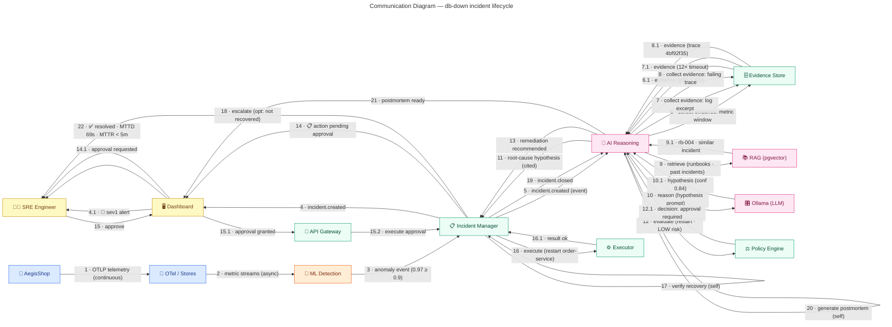
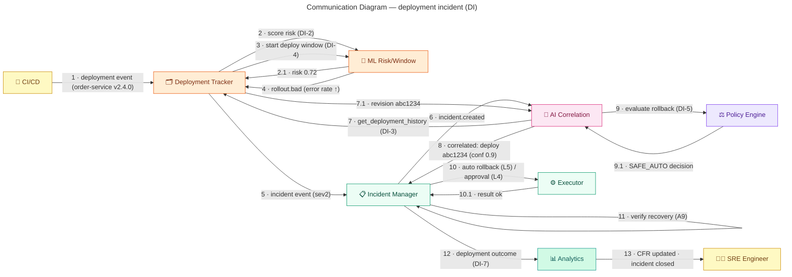

# Communication Diagram — Incident Lifecycle (db-down scenario)

> **Diagram 12 (UML 2.5 — Behavioral).** The same `db-down` incident lifecycle as the
> sequence diagram (#11), shown as a **communication (collaboration) diagram**:
> objects as nodes, **hierarchically numbered messages** on the links — structure and
> order in one view. Message names match Diagram 11 exactly (renumbered for nesting).
> Decided 2026-08-31.

---

## 1. Message Numbering (hierarchy explained)

| Number | Message | Nested under |
|---|---|---|
| 1–3 | telemetry → detection → incident | top-level flow |
| 4 / 4.1 | incident created → dashboard → alert | notification |
| 5–11 | investigation: evidence ×3, RAG, LLM, hypothesis | investigation (L2) |
| 12 / 12.1 | policy evaluation | recommendation (L3) |
| 13–14.1 | remediation recommended → approval request | recommendation |
| 15–15.2 | approval via gateway | governance (L4) |
| 16–16.1 | execution + result | execution |
| 17–18 | verification + optional escalation | verification (A9) |
| 19–22 | close → postmortem → resolution | closure |

## 2. Relationship to Sequence Diagram (#11)

| Aspect | Sequence (#11) | Communication (#12) |
|---|---|---|
| Focus | **Time order** (vertical lifelines) | **Structure** (objects + links) |
| Messages | same set, in time | same set, numbered by nesting |
| Participants | 13 lifelines | same 13 objects |
| Scenario | db-down incident | db-down incident |

> Rule of thumb: use #11 to see *when*, use #12 to see *who talks to whom* — the
> message names are identical by design, so the two diagrams can be cross-checked.

---

## 4. Deployment Incident Communication (DI)

The faulty-deploy scenario as a communication diagram — numbered messages show the
call structure of the DI flow.

### Message Hierarchy

| Number | Message | Feature |
|---|---|---|
| 1 | deployment event | DI-1 |
| 2 / 2.1 | risk scoring | DI-2 |
| 3–4 | window monitoring → bad | DI-4 |
| 5–8 | incident → correlation | DI-3 |
| 9 / 9.1 | rollback evaluation | DI-5 |
| 10 / 10.1 | execution | DI-5 |
| 11–13 | verification → CFR | A9, DI-7 |
