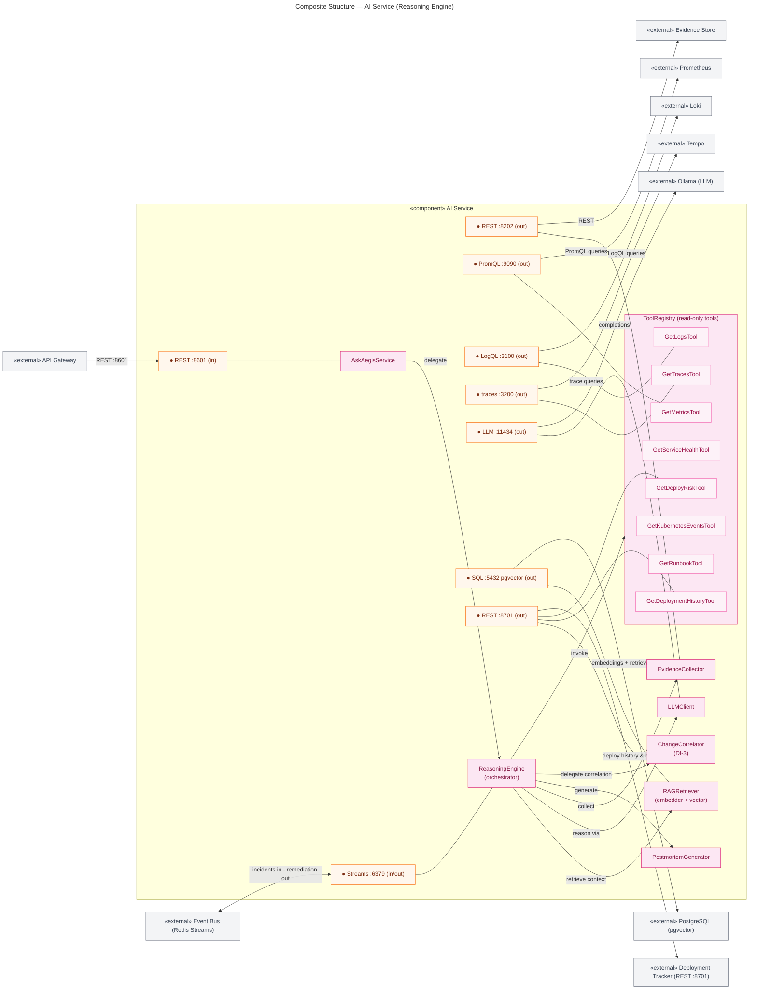

# Composite Structure Diagram — AI Reasoning Engine

> **Diagram 6 (UML 2.5 — Structural).** Internal structure of the **AI Service**
> component (Diagram 5): its parts, the ports on its boundary, and the connectors to
> the environment. Part names map 1:1 to classes in Diagram 2a. Decided 2026-08-31.

---

## 1. Parts (map to Diagram 2a classes)

| Part | Class in Diagram 2a | Responsibility |
|---|---|---|
| `ReasoningEngine` | ReasoningEngine | Orchestrates RCA: collect evidence → retrieve context → reason → hypothesize → recommend |
| `EvidenceCollector` | ReasoningEngine.collect_evidence | Fetches evidence via the Evidence Store API |
| `LLMClient` | ReasoningEngine.llm | Talks to the local LLM (Ollama) |
| `RAGRetriever` | RAGRetriever | Embeds + retrieves runbooks/past incidents from pgvector |
| `ToolRegistry` | list~Tool~ | Holds the eight compiled-in read-only tools |
| `GetMetricsTool` … `GetRunbookTool`, `GetDeployRiskTool` | the eight Tool realizations | Queries Prometheus/Loki/Tempo/registry/runbooks/**deploy risk** |
| `PostmortemGenerator` | PostmortemGenerator | Writes the incident postmortem on close |
| `AskAegisService` | AskAegisService | Chat front-end of the same engine (read-only) |

## 2. Ports & Environment Connectors

| Port | Direction | Connects to | Protocol |
|---|---|---|---|
| `REST :8601` | in | API Gateway | HTTP/JSON (RCA, ask, postmortem) |
| `Streams :6379` | in/out | Event Bus | Redis Streams (incident events in, remediation recommendations out) |
| `REST :8202` | out | Evidence Store | HTTP/JSON |
| `PromQL :9090` | out | Prometheus | HTTP (read-only) |
| `LogQL :3100` | out | Loki | HTTP (read-only) |
| `traces :3200` | out | Tempo | HTTP (read-only) |
| `LLM :11434` | out | Ollama | OpenAI-compatible API |
| `SQL :5432` | out | PostgreSQL (pgvector) | SQL (embeddings/retrieval) |
| `REST :8701` | out | Deployment Tracker | HTTP/JSON (deploy history, risk — DI-1/DI-2/DI-3) |

## 3. Design Invariants

- **All eight out-ports are read-only** — there is no write path from any part to any
  store (autonomy-model.md §3; component diagram §3).
- **ToolRegistry is compiled-in** — the AI cannot register new tools at runtime; the
  **eight** tools (seven telemetry/ops + `GetDeployRiskTool`) are the complete tool
  surface (security boundary).
- **AskAegisService and ReasoningEngine share the same engine** — a chat question and
  an incident RCA use identical evidence/grounding paths, so answers are equally
  citable.
