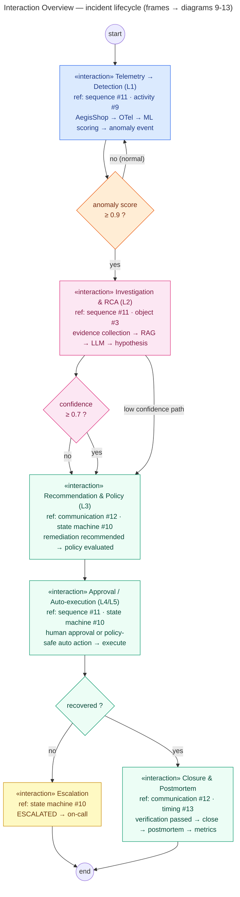

# Interaction Overview Diagram — Incident Lifecycle

> **Diagram 14 (UML 2.5 — Behavioral).** The **map of interactions**: an
> activity-style overview whose nodes are **interaction frames** referencing the
> detailed behavioral diagrams (#9 activity, #10 state machine, #11 sequence,
> #12 communication). Decision guards match the activity diagram exactly. This is
> the final diagram of the 14-diagram set. Decided 2026-08-31.



---

## 1. Frame → Diagram Mapping

| Frame | Expands to | Stage / Autonomy |
|---|---|---|
| F1 Telemetry → Detection | sequence #11 (first block), activity #9 (lanes 1–2) | L1 Detection |
| F2 Investigation & RCA | sequence #11 (evidence→RAG→LLM), object #3 | L2 Diagnosis |
| F3 Recommendation & Policy | communication #12 (msgs 12–14), state machine #10 | L3 Recommendation |
| F4 Approval / Auto-execution | sequence #11 (alt block), state machine #10 | L4 / L5 |
| F5 Closure & Postmortem | communication #12 (msgs 19–22), timing #13 | closure |
| F6 Escalation | state machine #10 (ESCALATED) | on-call |

## 2. How This Diagram Ties the Behavioral Set Together

```text
activity #9      → the workflow (swimlanes + guards)
state machine #10 → the states (incident + action)
sequence #11      → the time (lifelines)
communication #12 → the structure (numbered messages)
timing #13        → the clock (MTTD/MTTR)
interaction overview #14 → THE MAP (this diagram)
```

> Reading order for the behavioral set: **14 → 9 → 10 → 11/12 → 13** — start at the
> map, drill into the workflow, then the states, then the two interaction views, and
> finally the timing evidence.
