# Package Diagram — AegisShop (Demo Application)

> **Diagram 4b (UML 2.5 — Structural).** Module organization of the **AegisShop**
> demo application: gateway + four services + shared libs. Labeled dependency
> arrows; colors reused from Diagram 2b. Decided 2026-08-31.

```mermaid
---
title: "Package Diagram — AegisShop Demo Application"
---
flowchart TB
    %% ═══════════════════════════════════════════════════════
    %% AEGISSHOP PACKAGES
    %% ═══════════════════════════════════════════════════════
    subgraph SHOP["demoapp / aegisshop"]
        direction TB
        GW["gateway"]
        subgraph SVC["services"]
            CATALOG["catalog"]
            CART["cart"]
            ORDER["order"]
            PAYMENT["payment"]
        end
        subgraph LIBS["libs"]
            OTEL["otel-instrumentation"]
            FAULTS["fault-hooks"]
            DB["db-models"]
        end
    end

    %% ═══════════════════════════════════════════════════════
    %% EXTERNAL PACKAGES (referenced, not owned)
    %% ═══════════════════════════════════════════════════════
    REDIS["external: redis"]
    POSTGRES["external: postgres"]
    PGGW["external: payment-gateway"]
    CHAOS["chaoslab (Diagram 4c)"]

    %% ═══════════════════════════════════════════════════════
    %% DEPENDENCIES
    %% ═══════════════════════════════════════════════════════
    GW -->|routes to| CATALOG
    GW -->|routes to| CART
    GW -->|routes to| ORDER
    GW -->|routes to| PAYMENT
    ORDER -->|uses| POSTGRES
    ORDER -->|uses| DB
    CART -->|uses| REDIS
    PAYMENT -->|calls| PGGW
    CATALOG -->|uses| DB
    CATALOG -->|instrumented by| OTEL
    CART -->|instrumented by| OTEL
    ORDER -->|instrumented by| OTEL
    PAYMENT -->|instrumented by| OTEL
    GW -->|instrumented by| OTEL
    CATALOG -.->|implements| FAULTS
    CART -.->|implements| FAULTS
    ORDER -.->|implements| FAULTS
    PAYMENT -.->|implements| FAULTS
    GW -.->|implements| FAULTS
    CHAOS -->|injects via| FAULTS

    %% ═══════════════════════════════════════════════════════
    %% COLOR CODING (same as Diagram 2b)
    %% ═══════════════════════════════════════════════════════
    classDef svc fill:#dbeafe,stroke:#2563eb,color:#1e3a8a;
    classDef entity fill:#ecfdf5,stroke:#059669,color:#064e3b;
    classDef ext fill:#f3f4f6,stroke:#6b7280,color:#374151;
    classDef chaos fill:#fef3c7,stroke:#d97706,color:#78350f;
    class GW,CATALOG,CART,ORDER,PAYMENT svc;
    class OTEL,DB entity;
    class REDIS,POSTGRES,PGGW ext;
    class FAULTS,CHAOS chaos;
```

---

## 1. Package Map

| Package | Contents | Notes |
|---|---|---|
| `demoapp.aegisshop.gateway` | API gateway | public entry, auth, rate limit |
| `demoapp.aegisshop.services.catalog` | catalog API + products | CPU-saturation fault target |
| `demoapp.aegisshop.services.cart` | cart API (Redis) | Redis-down fault target |
| `demoapp.aegisshop.services.order` | order API (Postgres) | DB-down / faulty-deploy target |
| `demoapp.aegisshop.services.payment` | simulated payments | crash / 5xx / latency target |
| `demoapp.aegisshop.libs.otel-instrumentation` | OTel metrics/logs/traces | envelope-compliant (A1) |
| `demoapp.aegisshop.libs.fault-hooks` | chaos injection interface | demo-only, never public-API-reachable |
| `demoapp.aegisshop.libs.db-models` | SQLAlchemy models | shared by catalog/order |

## 2. Dependency Rules

- **Gateway is the only public entry** — services are not exposed directly.
- **Every service implements `fault-hooks`** — this is what makes the app chaos-ready
  (A11) and is the single integration point for the chaoslab.
- **Telemetry flows out through `otel-instrumentation`** to the observability stack
  (Diagram 4c) — services never talk to Prometheus/Loki/Tempo directly.
