# Package Diagram — AegisSRE Platform

> **Diagram 4a (UML 2.5 — Structural).** Module (package) organization of the
> platform: `backend/`, `ml/`, `ai/` with their sub-packages, shown with **labeled
> dependency arrows**. Sub-package granularity mirrors the five class-diagram layers
> (Diagram 2a) and the same color coding is reused. Decided 2026-08-31.

```mermaid
---
title: "Package Diagram — AegisSRE Platform"
---
flowchart TB
    %% ═══════════════════════════════════════════════════════
    %% BACKEND PACKAGE
    %% ═══════════════════════════════════════════════════════
    subgraph BACKEND["backend"]
        direction TB
        subgraph SVC["services"]
            GATEWAY["gateway"]
            REGISTRY["registry"]
            INCIDENTS["incidents"]
            EVIDENCE["evidence"]
            REMEDIATION["remediation"]
            POLICY["policy"]
            AUDIT["audit"]
            AUTONOMY["autonomy"]
        end
        subgraph LIBS["libs"]
            TELEMETRY["telemetry (envelope)"]
            EVENTBUS["eventbus (redis streams)"]
        end
    end

    %% ═══════════════════════════════════════════════════════
    %% ML PACKAGE
    %% ═══════════════════════════════════════════════════════
    subgraph ML["ml"]
        direction TB
        subgraph DET["detection"]
            FEATURES["feature-pipeline"]
            STAT["statistical-detector"]
            ISO["isolation-forest-detector"]
        end
    end

    %% ═══════════════════════════════════════════════════════
    %% AI PACKAGE
    %% ═══════════════════════════════════════════════════════
    subgraph AI["ai"]
        direction TB
        REASON["reasoning"]
        RAG["rag"]
        TOOLS["tools"]
        POSTMORTEM["postmortem"]
    end

    %% ═══════════════════════════════════════════════════════
    %% DEPENDENCIES (labeled dashed arrows)
    %% ═══════════════════════════════════════════════════════
    GATEWAY -->|routes to| REGISTRY
    GATEWAY -->|routes to| INCIDENTS
    GATEWAY -->|routes to| REMEDIATION
    GATEWAY -->|routes to| AUDIT

    REGISTRY -->|uses| TELEMETRY
    INCIDENTS -->|uses| TELEMETRY
    INCIDENTS -->|publishes & consumes| EVENTBUS
    EVIDENCE -->|stores envelopes| TELEMETRY
    REMEDIATION -->|evaluated by| POLICY
    REMEDIATION -->|logged in| AUDIT
    POLICY -->|uses| TELEMETRY
    AUTONOMY -->|controls mode of| REMEDIATION
    AUTONOMY -->|uses| TELEMETRY

    STAT -->|implements| FEATURES
    ISO -->|implements| FEATURES
    FEATURES -->|consumes metric events| EVENTBUS
    FEATURES -->|emits anomaly events| EVENTBUS

    REASON -->|consumes incidents| EVENTBUS
    REASON -->|invokes| TOOLS
    REASON -->|retrieves context from| RAG
    REASON -->|collects evidence via| EVIDENCE
    TOOLS -->|queries stores| TELEMETRY
    POSTMORTEM -->|uses| REASON

    %% ═══════════════════════════════════════════════════════
    %% COLOR CODING (same 5 layers as Diagram 2a)
    %% ═══════════════════════════════════════════════════════
    classDef telemetry fill:#dbeafe,stroke:#2563eb,color:#1e3a8a;
    classDef eventlayer fill:#ede9fe,stroke:#7c3aed,color:#4c1d95;
    classDef domain fill:#ecfdf5,stroke:#059669,color:#064e3b;
    classDef ml fill:#ffedd5,stroke:#ea580c,color:#7c2d12;
    classDef ai fill:#fce7f3,stroke:#db2777,color:#831843;
    class TELEMETRY telemetry;
    class EVENTBUS eventlayer;
    class GATEWAY,REGISTRY,INCIDENTS,EVIDENCE,REMEDIATION,POLICY,AUDIT,AUTONOMY domain;
    class FEATURES,STAT,ISO ml;
    class REASON,RAG,TOOLS,POSTMORTEM ai;
```

---

## 1. Package Map

| Package | Contents | Class-diagram layer |
|---|---|---|
| `backend.services.gateway` | API gateway (routing, auth, rate limit) | Domain |
| `backend.services.registry` | Service registry + health | Domain |
| `backend.services.incidents` | Incident manager, timeline | Domain |
| `backend.services.evidence` | Evidence store (append-only) | Domain |
| `backend.services.remediation` | Remediation planner + executor API | Domain |
| `backend.services.policy` | Policy engine (decision point) | Domain |
| `backend.services.audit` | Audit log | Domain |
| `backend.services.autonomy` | Autonomy mode controller (kill switch) | Domain |
| `backend.libs.telemetry` | Event envelope + payload schemas (Pydantic) | Telemetry |
| `backend.libs.eventbus` | Redis Streams producer/consumer (ADR-0004) | Event layer |
| `ml.detection.*` | Feature pipeline + detectors | ML |
| `ai.reasoning` | RCA engine, hypotheses | AI |
| `ai.rag` | pgvector retrieval | AI |
| `ai.tools` | The seven read-only tools | AI |
| `ai.postmortem` | Postmortem generator | AI |

## 2. Key Dependency Rules

- **Everything uses the envelope** (`backend.libs.telemetry`) — no bespoke event shapes.
- **Cross-service calls go through the gateway** — services do not call each other directly.
- **ML and AI communicate through the event bus** — decoupled from the domain services.
- **The policy engine is the only evaluator of remediation** (dependency direction
  `remediation → policy`, never the reverse).
- `ai.tools → stores` is **read-only by design** — the tool layer can query telemetry
  but has no write path (autonomy-model.md §3).

## 3. Boundaries

- `ai.tools` queries the observability stores (Prometheus/Loki/Tempo) — those live in
  the **infra/ops** package diagram (Diagram 4c).
- The frontend consumes only the gateway — it never sees these packages directly.
