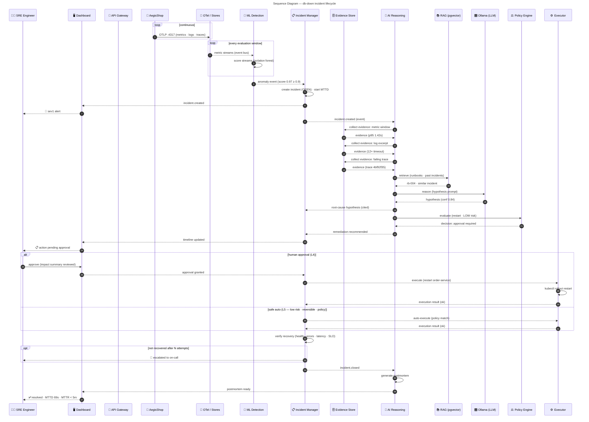

# Sequence Diagram — Incident Lifecycle (db-down scenario)

> **Diagram 11 (UML 2.5 — Behavioral).** The time-ordered interaction for the
> full incident lifecycle — the same `db-down` demo scenario as the object diagram
> (#3). Solid arrows = synchronous calls, dashed arrows = async events/returns;
> `alt`/`opt`/`loop` fragments show decision structure. Decided 2026-08-31.

---

## 1. Interaction Summary

| Stage | Messages | Autonomy |
|---|---|---|
| Telemetry | shop → stores (loop) | — |
| Detection | ML scores → anomaly event | L1 |
| Investigation | AI collects 3 evidence items → RAG → LLM → hypothesis | L2 |
| Recommendation | policy decision → remediation recommended | L3 |
| Execution | **alt: human approve (L4) / policy auto (L5)** | L4/L5 |
| Verification | recovery checks → close or escalate (opt) | gate |
| Postmortem | AI generates report → dashboard | — |

## 2. Sync vs Async Convention

| Arrow | Meaning | Used for |
|---|---|---|
| `->>` solid | synchronous call (request/response) | REST APIs (gateway, evidence store, policy, executor) |
| `-->>` dashed | async event or return | event bus messages, notifications, returns |
| `->>` self | internal computation | scoring, incident creation, verification, postmortem |

## 3. Consistency Map

| Element | Same as |
|---|---|
| Scenario + timestamps | Object diagram (#3) snapshot 10:17:02Z |
| Statuses | State machine (#10) — OPEN → … → CLOSED |
| Participants | Activity swimlanes (#9) + component interfaces (#5) |
| Policy decision | Policy engine = only decision point (autonomy-model.md §2) |
| Guard values | anomaly ≥ 0.9 (A3), confidence ≥ 0.7 (A5), N attempts (A9) |
