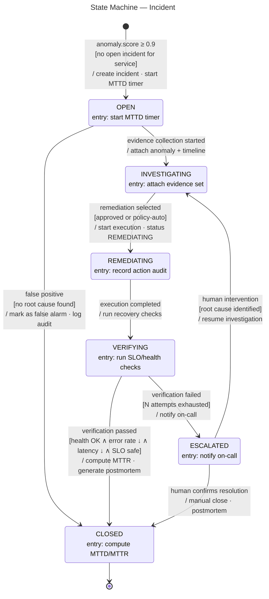
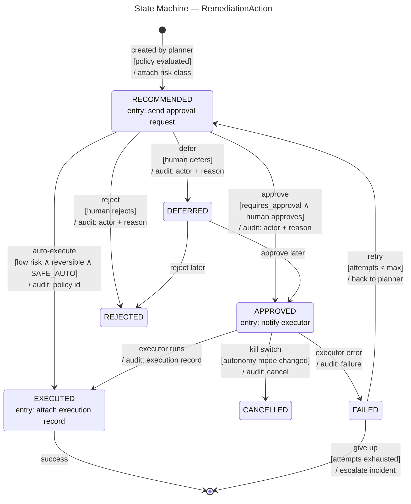

# State Machine Diagram — Incident & RemediationAction Lifecycles

> **Diagram 10 (UML 2.5 — Behavioral).** Two state machines:
> (1) the **Incident** lifecycle — the canonical statuses used across this whole UML
> set (class diagram #2a, activity diagram #9, object diagram #3); (2) the
> **RemediationAction** lifecycle. Full transitions: `trigger [guard] / effect`;
> entry actions and initial/final states included. Decided 2026-08-31.

---

## 1. Incident State Machine — Semantics

| Transition | Trigger | Guard | Effect |
|---|---|---|---|
| `[*] → OPEN` | anomaly event | score ≥ 0.9, no open incident for the service | create incident, start MTTD timer |
| `OPEN → INVESTIGATING` | evidence collection started | — | attach anomaly + timeline |
| `OPEN → CLOSED` | false positive | no root cause found | mark false alarm, audit |
| `INVESTIGATING → REMEDIATING` | remediation selected | approved or policy-auto | start execution |
| `REMEDIATING → VERIFYING` | execution completed | — | run recovery checks (A9) |
| `VERIFYING → CLOSED` | verification passed | health OK ∧ error ↓ ∧ latency ↓ ∧ SLO safe | compute MTTR, postmortem |
| `VERIFYING → ESCALATED` | verification failed | N attempts exhausted | notify on-call |
| `ESCALATED → INVESTIGATING` | human intervention | root cause identified | resume investigation |
| `ESCALATED → CLOSED` | human confirms | resolution | manual close |

## 2. RemediationAction State Machine — Semantics

| Transition | Meaning |
|---|---|
| `RECOMMENDED → APPROVED/REJECTED/DEFERRED` | The three human governance choices (A7) |
| `RECOMMENDED → EXECUTED` | The **Level 5** path: policy allows safe-auto execution |
| `APPROVED → CANCELLED` | Kill switch / autonomy-mode change mid-flight (A8) |
| `FAILED → RECOMMENDED` | Retry with backoff (attempts < max) |
| `FAILED → [*]` | Escalation: incident becomes ESCALATED |

## 3. Consistency Map

| Concept | Diagram 2a | Diagram 9 | Diagram 3 | This diagram |
|---|---|---|---|---|
| Statuses | `IncidentStatus` enum | statuses in activity states | `inc1.status = INVESTIGATING` | state names |
| Approval modes | `AutonomyMode` enum | L4/L5 branches | `ra1.mode = approval` | RECOMMENDED → APPROVED vs EXECUTED |
| Verification | `A9` class note | `DEC6` guard | — | VERIFYING → CLOSED/ESCALATED |

> One source of truth: if a status changes anywhere, it changes here first.
