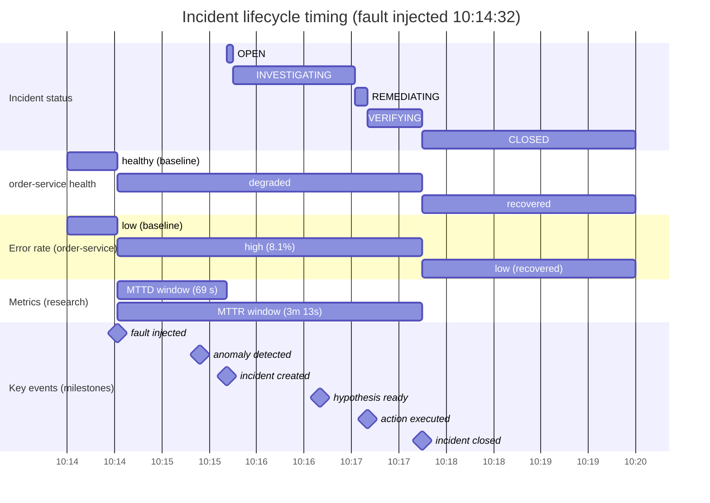

# Timing Diagram — Incident Lifecycle (db-down scenario)

> **Diagram 13 (UML 2.5 — Behavioral).** State changes **over time** for the same
> `db-down` scenario: incident status, `order-service` health, and error rate across
> the real demo timeline (2026-08-31 10:14–10:20). MTTD/MTTR windows are marked, and
> key events appear as milestones — the research metrics made visible. Decided
> 2026-08-31.

---

## 1. Timeline of Events (consistent with object diagram #3)

| Time | Event | Metric |
|---|---|---|
| 10:14:32 | Fault injected (Postgres down for order-service) | — |
| 10:15:00 | p95 latency 1.42 s, error rate 8.1% | — |
| 10:15:24 | Anomaly detected (score 0.97) | — |
| 10:15:41 | Incident created | **MTTD = 69 s** |
| 10:16:05 | Evidence collected (metric/log/trace) | — |
| 10:16:40 | Hypothesis ready (conf 0.84) | — |
| 10:17:02 | Remediation selected → executing | — |
| 10:17:10 | Action executed (restart) | — |
| 10:17:45 | Recovery verified → closed | **MTTR = 3 m 13 s** |

## 2. Lane Semantics

| Lane | States | What it shows |
|---|---|---|
| Incident status | OPEN → INVESTIGATING → REMEDIATING → VERIFYING → CLOSED | The state machine (#10) running over real time |
| order-service health | healthy → degraded → recovered | The monitored subject's perspective |
| Error rate | low → high (8.1%) → low | The signal that drove detection |
| Metrics | MTTD/MTTR windows | The research question's headline numbers |

## 3. How This Supports the Evaluation (A12)

- **MTTD** is measured from fault injection (chaoslab ground truth) to incident
  creation — 69 s in this run.
- **MTTR** runs from fault injection to verified recovery — 3 m 13 s here.
- The same chart, generated per experiment run, becomes the evidence base for the
  baseline-vs-platform comparison in the evaluation report
  ([docs/operations/evaluation.md](../../operations/evaluation.md)).
